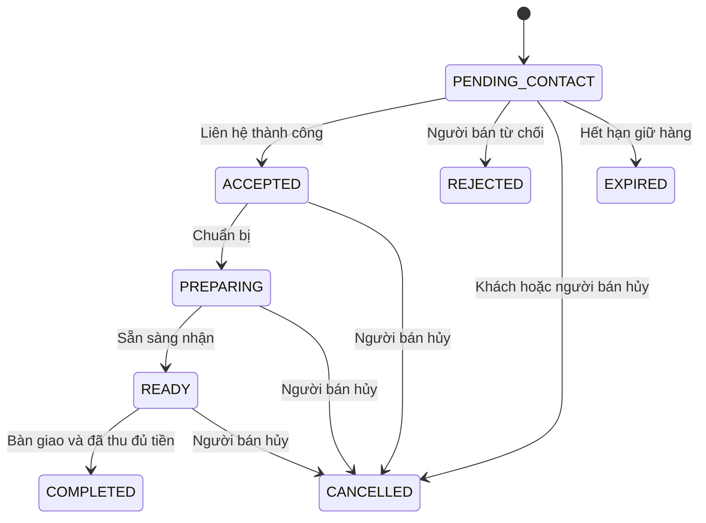

# SPEC TRIỂN KHAI WEBSITE BÁN HÀNG TRONG TRƯỜNG

> Phiên bản: 1.0 — Ngày: 09/10/2026  
> Mục đích: tài liệu yêu cầu và kế hoạch triển khai cho coding agent.  
> Ngôn ngữ giao diện: tiếng Việt. Tiền tệ: VND. Múi giờ hiển thị: Asia/Ho_Chi_Minh.  
> Đây là spec để triển khai; chưa phải ứng dụng đã được xây dựng hoặc kiểm thử.

## 1. Mục tiêu và quyết định mặc định

Xây dựng website bán đồ ăn vặt và đồ lưu niệm đơn giản cho học sinh trong một trường. Người mua chọn sản phẩm hoặc combo tại landing page, thêm vào giỏ hàng và đặt đơn. Người bán nhận đơn trong dashboard, liên hệ người mua rồi chấp nhận hoặc từ chối. Người mua nhận hàng tại điểm hẹn trong trường và trả bằng tiền mặt hoặc chuyển khoản qua QR của shop.

Website có đúng hai role nghiệp vụ: `SELLER` và `CUSTOMER`. Khách chưa đăng nhập là trạng thái truy cập guest, không phải role thứ ba và không cần tạo tài khoản Supabase anonymous.

| Nội dung | Quyết định mặc định cho MVP |
| --- | --- |
| Mô hình kinh doanh | Một shop, một người bán chính; schema có thể cho phép thêm tài khoản SELLER cùng quản lý shop sau này |
| Đăng nhập khách hàng | Email và mật khẩu qua Supabase Auth; xác minh email, quên mật khẩu |
| Email liên hệ | Chấp nhận Gmail và các email hợp lệ khác, không giới hạn tên miền gmail.com |
| Checkout | Không bắt buộc đăng nhập; bắt buộc họ tên, số điện thoại và email |
| Nhận hàng | Gặp trực tiếp tại các địa điểm đã được shop cấu hình trong trường |
| Thanh toán | Tiền mặt hoặc chuyển khoản; người bán đối soát và xác nhận thủ công |
| Số lượng tồn kho | Theo dõi cho từng sản phẩm; combo dùng chung tồn kho các thành phần |
| Cập nhật liên tục | Làm mới dữ liệu bằng polling, không phải tải lại toàn bộ trang |
| Kiến trúc backend | Modular monolith Spring Boot, ba tầng Controller → Service → Repository |
| UI/UX | Coding agent đọc file Markdown UI/UX do chủ dự án cung cấp trước khi viết giao diện |

Các quyết định trên là giả định triển khai được đề xuất, không phải thông tin đã được chủ shop cung cấp. Những thông tin cần điền trước khi đưa vào sử dụng nằm tại mục 20.

## 2. Phạm vi chức năng

### 2.1. MVP bắt buộc

- Landing page giới thiệu shop, sản phẩm đồ ăn vặt, đồ lưu niệm và combo.
- Danh mục, tìm kiếm theo tên, lọc danh mục và sắp xếp giá.
- Chi tiết sản phẩm/combo, hình ảnh, giá, mô tả, tình trạng còn hàng.
- Giỏ hàng: thêm, sửa số lượng, xóa, xem tổng tiền.
- Checkout có tài khoản và không có tài khoản.
- Chọn tiền mặt hoặc ngân hàng; hiển thị QR và hướng dẫn chuyển khoản.
- Trang kết quả đặt hàng, mã đơn và trạng thái đơn.
- Khách đăng nhập xem lịch sử và chi tiết đơn của chính mình.
- Guest xem lại đơn qua quyền truy cập bí mật đã được cấp khi đặt hàng.
- Dashboard người bán: đơn mới, liên hệ, chấp nhận/từ chối, chuẩn bị, bàn giao, thanh toán.
- Người bán thêm/sửa/ẩn sản phẩm, upload hình, sửa giá và tồn kho, tạo combo.
- Cấu hình shop, thông tin ngân hàng, QR và điểm nhận hàng.
- Audit log cho thao tác nghiệp vụ quan trọng.
- Tự cập nhật catalog, đơn hàng và thông báo trong ứng dụng.
- Kiểm tra đầu vào, phân quyền backend, xử lý lỗi và thao tác trùng lặp.

### 2.2. Chưa triển khai trong MVP

- Marketplace nhiều shop, phân chia hoa hồng, ví nội bộ.
- Cổng thanh toán, webhook ngân hàng, tự xác nhận chuyển khoản.
- Vận chuyển ngoài trường, tính phí giao hàng.
- Chat thời gian thực, tự gửi SMS, email hoặc tin nhắn Zalo.
- Voucher, điểm thưởng, đánh giá, recommendation, tích hợp POS.
- Liên kết tự động các đơn guest cũ vào tài khoản mới dựa trên email.

Không thêm các chức năng ngoài phạm vi này nếu chưa có yêu cầu cập nhật spec.

## 3. Role và quyền truy cập

| Chức năng | Guest | CUSTOMER | SELLER |
| --- | --- | --- | --- |
| Xem catalog, tìm kiếm, thêm giỏ | Có | Có | Có |
| Đặt hàng | Có | Có | Có qua giao diện công khai |
| Xem một đơn do mình đặt | Bằng guest token | Theo account ID | Theo account ID hoặc quyền quản lý shop |
| Xem lịch sử tài khoản | Không | Chỉ đơn của mình | Chỉ đơn của mình nếu có đặt hàng |
| Hủy đơn | Theo quy tắc trạng thái | Theo quy tắc trạng thái | Theo quy tắc quản lý |
| Nhận và quản lý tất cả đơn shop | Không | Không | Có |
| Xem thông tin liên hệ người mua | Chỉ thông tin trong đơn của mình | Chỉ thông tin trong đơn của mình | Có, phục vụ xử lý đơn |
| Quản lý sản phẩm, ảnh, combo, tồn kho | Không | Không | Có |
| Đánh dấu đã thu tiền/đã hoàn tiền | Không | Không | Có |
| Thay đổi QR và cấu hình shop | Không | Không | Có |
| Xem audit log shop | Không | Không | Có |
| Tự đổi role của tài khoản | Không | Không | Không |

Tài khoản đăng ký công khai luôn nhận role `CUSTOMER`. Tài khoản `SELLER` được chủ dự án cấp qua quy trình quản trị ngoài ứng dụng, không có nút đăng ký người bán. Role được backend đọc từ DB; không tin role gửi trong body, localStorage hoặc user metadata do người dùng tự sửa.

Mọi API đơn hàng phải kiểm tra ownership tại backend. Việc ẩn nút ở React chỉ phục vụ UX.

## 4. Luồng sử dụng

### 4.1. Khách chưa đăng nhập

1. Mở landing page, tìm/lọc và xem sản phẩm hoặc combo.
2. Chọn số lượng, thêm vào giỏ; xem tổng tiền dự kiến.
3. Mở checkout và chọn tiếp tục không đăng nhập.
4. Nhập họ tên, số điện thoại, email, điểm nhận hàng, thời gian mong muốn và ghi chú nếu có.
5. Chọn `CASH` hoặc `BANK_TRANSFER`.
6. Gửi đơn; backend kiểm tra catalog, giá và tồn kho, giữ hàng trong transaction.
7. Backend tạo đơn `PENDING_CONTACT`, thanh toán `UNPAID`, trả mã đơn và guest token một lần.
8. Trang kết quả hiển thị mã đơn, tổng tiền, trạng thái chờ liên hệ và cách lưu quyền xem lại đơn.
9. Người bán liên hệ và xác nhận. Người mua theo dõi tiến độ bằng guest token.
10. Nếu chuyển khoản: chỉ chuyển sau khi đơn được chấp nhận, dùng đúng số tiền và nội dung mã đơn; có nút “Tôi đã chuyển khoản” để báo người bán kiểm tra.
11. Người bán kiểm tra tiền vào tài khoản rồi xác nhận đã thanh toán. Nếu tiền mặt, người bán xác nhận khi thực sự thu tiền.
12. Người bán bàn giao hàng và hoàn tất đơn khi đã thu đủ tiền.

### 4.2. Khách đã đăng nhập

Luồng chọn hàng và checkout như guest, nhưng backend gắn `customer_id` từ JWT đã xác thực. Form có thể điền sẵn profile; người mua vẫn được sửa thông tin liên hệ riêng của đơn. Thông tin checkout được snapshot, không tự ghi đè profile.

Sau khi đặt đơn, khách xem trong `/account/orders` và xem chi tiết tại `/account/orders/:orderId`. Chỉ các đơn gắn với account hiện tại xuất hiện. Đơn guest cũ không tự gắn theo họ tên, số điện thoại hoặc email.

### 4.3. Người bán xử lý đơn

1. Đăng nhập tài khoản SELLER, mở `/seller/orders`.
2. Dashboard hiển thị đơn mới, badge số đơn chưa xử lý và thông báo trong ứng dụng.
3. Mở đơn, xem món đã mua, tổng tiền, phương thức thanh toán và liên hệ.
4. Liên hệ ngoài hệ thống bằng điện thoại/email; ghi nhận phương thức, thời gian và kết quả liên hệ.
5. Nếu liên hệ thành công, thỏa thuận được điểm/thời gian nhận và còn đủ hàng đã giữ: chấp nhận đơn.
6. Nếu không thể xử lý: từ chối và nhập lý do; hệ thống trả lại lượng hàng đang giữ.
7. Cập nhật đang chuẩn bị, sẵn sàng nhận; kiểm tra thanh toán nếu chuyển khoản.
8. Thu tiền mặt nếu chưa thu, bàn giao và đánh dấu hoàn tất.
9. Các thay đổi trạng thái, tồn kho và thanh toán được ghi log cùng transaction.

“Đơn gửi tới tài khoản người bán” trong MVP nghĩa là đơn được lưu trong DB và xuất hiện trong dashboard của SELLER; không mặc định gửi email/SMS.

### 4.4. Người bán quản lý catalog

1. Tạo món mới: tên, danh mục, mô tả, giá, tồn kho, hình ảnh.
2. Có thể lưu nháp; chỉ sản phẩm `ACTIVE` xuất hiện cho người mua.
3. Sửa giá hoặc thông tin; lưu thành công thì dữ liệu mới xuất hiện tại landing page ở lần làm mới kế tiếp.
4. Tạo combo: tên, ảnh, mô tả, các sản phẩm thành phần và số lượng từng món, giá combo.
5. Ẩn sản phẩm/combo khi tạm ngừng bán; không xóa vật lý dữ liệu đã được dùng trong đơn.
6. Điều chỉnh tồn kho phải có lý do và không được làm tổng tồn thấp hơn lượng đang giữ.

## 5. Quy tắc nghiệp vụ

### 5.1. Sản phẩm và giá

- Mỗi sản phẩm gồm: ID, slug, tên, danh mục, mô tả, ảnh chính, giá VND, tổng tồn, tồn đang giữ, trạng thái.
- Danh mục khởi tạo: `SNACK` — Đồ ăn vặt; `SOUVENIR` — Đồ lưu niệm.
- Với đồ ăn: hỗ trợ mô tả thành phần/dị ứng và hướng dẫn bảo quản dưới dạng nội dung tùy chọn.
- Giá là số nguyên VND, lớn hơn 0; backend dùng `BigDecimal`, DB `numeric(14,0)`. Không dùng floating point để tính tiền.
- `available_stock = stock_on_hand - stock_reserved`, hai giá trị luôn không âm và `stock_reserved <= stock_on_hand`.
- Trạng thái catalog: `DRAFT`, `ACTIVE`, `ARCHIVED`.
- Hết hàng vẫn có thể hiển thị trên catalog nhưng vô hiệu hóa thêm giỏ/đặt hàng.
- Giỏ lưu ID và số lượng, dữ liệu giá chỉ để hiển thị. Backend quyết định giá cuối cùng.
- Đơn lưu snapshot tên, giá, ảnh và thành phần combo tại thời điểm tạo. Sửa catalog không thay đổi lịch sử đơn.

### 5.2. Combo

- Combo có từ hai sản phẩm khác nhau trở lên, số lượng thành phần là số nguyên dương.
- Combo không chứa combo khác. Không cho lưu thành phần trùng product ID; gộp trước khi lưu.
- Giá combo do SELLER nhập, lớn hơn 0 và không vượt tổng giá mua lẻ tại thời điểm tạo/sửa.
- Nếu giá mua lẻ giảm khiến combo không còn tiết kiệm, không tự sửa giá combo và không hiển thị thông điệp giảm giá sai. Dashboard cảnh báo để người bán xem lại; khách vẫn thấy giá thực tế.
- Mọi thành phần phải ACTIVE để combo có thể bán. Ẩn một thành phần khiến combo phụ thuộc tạm không thể đặt.
- Không có cột tồn kho độc lập cho combo. Số combo khả dụng là giá trị nhỏ nhất của `floor(available_stock_i / component_quantity_i)`.
- Ví dụ: combo gồm 2 bánh + 1 móc khóa; bánh còn 10, móc khóa còn 3 → bán tối đa 3 combo.
- Một giỏ vừa có món lẻ vừa có combo phải cộng dồn nhu cầu cho từng sản phẩm trước khi kiểm tra tồn.
- Khi tính khả dụng, phải xét toàn bộ giỏ; không kiểm tra từng dòng riêng rồi bỏ qua phần tồn được dùng chung.

### 5.3. Giỏ hàng và checkout

- Giỏ guest lưu cục bộ, chỉ chứa catalog IDs, số lượng và phiên bản cấu trúc; không lưu thông tin liên hệ hoặc quyền guest.
- Khi đăng nhập, giữ giỏ hiện tại trên cùng thiết bị. Đồng bộ giỏ qua nhiều thiết bị nằm ngoài MVP.
- Một dòng có số lượng từ 1 đến 20; tối đa 30 dòng/đơn. Đây là cấu hình mặc định có thể điều chỉnh.
- `POST /checkout/quote` xác thực giỏ và trả giá, khả dụng, tổng tiền; quote không giữ hàng.
- Quote trả token có hạn 5 phút, gắn giỏ, phiên bản giá catalog và phương thức/thiết lập thanh toán liên quan; lưu hoặc ký token phía backend.
- Nếu giá, trạng thái bán hoặc thiết lập thanh toán thay đổi trước lúc submit: trả `409 CHECKOUT_CHANGED`, gửi quote mới và yêu cầu người mua xác nhận lại; không tự tạo đơn ở giá mới.
- Backend vẫn kiểm tra và khóa tồn khi tạo đơn, kể cả quote còn hạn.
- Tổng tiền MVP = tổng các dòng; không phí giao hàng hoặc giảm giá ngoài combo.
- Thời gian nhận là mong muốn của khách, chưa được bảo đảm cho tới khi SELLER xác nhận.
- Shop có thể tắt nhận đơn bằng `accepting_orders=false`; API tạo đơn kiểm tra cờ này trong bước xác nhận cuối.

### 5.4. Thông tin người mua

| Trường | Bắt buộc | Kiểm tra |
| --- | --- | --- |
| Họ tên | Có | Trim, 2–100 ký tự, cho phép tên tiếng Việt |
| Số điện thoại | Có | Chuẩn hóa khoảng trắng/dấu phân cách; hỗ trợ 10 chữ số bắt đầu bằng 0 hoặc định dạng +84 tương đương; dùng thư viện validation phù hợp |
| Email | Có | Định dạng hợp lệ, tối đa 254 ký tự; email guest là thông tin liên hệ chưa xác minh |
| Điểm nhận | Có | Chọn một pickup point đang hoạt động của shop |
| Thời gian mong muốn | Không | Thời gian hợp lệ trong tương lai, hiển thị đúng múi giờ |
| Lớp | Không | Tối đa 50 ký tự |
| Ghi chú | Không | Tối đa 500 ký tự, plain text |

Form nêu rõ thông tin được dùng để liên hệ và xử lý đơn. Không công khai danh sách người mua hoặc thông tin liên hệ trên landing page.

### 5.5. Vòng đời đơn hàng



| Trạng thái | Ý nghĩa và điều kiện |
| --- | --- |
| `PENDING_CONTACT` | Đơn đã lưu, hàng đã giữ, chờ người bán liên hệ |
| `ACCEPTED` | Có contact attempt kết quả SUCCESS, đã xác nhận điểm và thời gian nhận |
| `PREPARING` | Người bán đang chuẩn bị hàng |
| `READY` | Có thể bàn giao |
| `COMPLETED` | Đã giao hàng và `payment_status=PAID`; tiêu thụ lượng hàng đã giữ |
| `REJECTED` | Từ chối từ PENDING_CONTACT, bắt buộc lý do |
| `CANCELLED` | Hủy theo quyền và trạng thái cho phép, bắt buộc lý do |
| `EXPIRED` | Đơn PENDING_CONTACT quá thời hạn, chưa được chấp nhận |

- Khách/guest được hủy trực tiếp chỉ ở PENDING_CONTACT và payment UNPAID; sau ACCEPTED phải liên hệ SELLER.
- SELLER được hủy đơn chưa COMPLETED. Không mở lại đơn terminal; nếu mua tiếp phải tạo đơn mới.
- Không sửa danh sách món hoặc giá của đơn đã tạo. Sai món thì hủy và tạo lại.
- Mọi chuyển trạng thái đi qua service kiểm tra state machine, version và quyền; không nhận chuỗi trạng thái tùy ý rồi ghi thẳng DB.
- Mặc định giữ hàng cho PENDING_CONTACT trong 24 giờ; lưu thời điểm hết hạn tại đơn. Scheduler kiểm tra mỗi phút.
- Đơn đã ACCEPTED tiếp tục giữ hàng cho tới khi COMPLETED hoặc SELLER hủy; không tự hết hạn sau khi nhận tiền. Dashboard cảnh báo đơn quá giờ hẹn để người bán xử lý.
- PENDING_CONTACT đã báo chuyển/đã thu tiền bất thường phải được đưa vào kiểm tra thủ công, không tự EXPIRED để tránh bỏ sót việc hoàn tiền.
- Mỗi thao tác terminal chỉ trả/tiêu thụ tồn kho một lần, kể cả retry hoặc scheduler chạy cùng lúc.

### 5.6. Thanh toán

Phương thức `CASH` và `BANK_TRANSFER` tách biệt khỏi trạng thái đơn. Người bán có thể chấp nhận đơn tiền mặt chưa thu tiền.

| Payment status | Ý nghĩa |
| --- | --- |
| `UNPAID` | Chưa xác nhận nhận đủ tiền |
| `REPORTED` | Khách báo đã chuyển khoản, chờ đối soát; không có nghĩa là đã thanh toán |
| `PAID` | Người bán xác nhận đã thu đủ tiền |
| `REFUND_PENDING` | Đơn đã hủy/từ chối nhưng còn tiền cần hoàn |
| `REFUNDED` | Người bán xác nhận đã hoàn tiền |

- Khách chọn phương thức tại checkout; giữ cố định sau khi tạo đơn trong MVP.
- Đơn BANK_TRANSFER hiển thị ảnh QR, ngân hàng, số tài khoản, chủ tài khoản, số tiền và nội dung chuyển khoản = mã đơn.
- QR là ảnh shop tải lên. Không giả định QR tự chứa đúng số tiền hoặc tự đổi nội dung theo đơn; số tiền và nội dung luôn hiển thị riêng.
- Tại PENDING_CONTACT có thể xem QR nhưng phải hiển thị “Chờ người bán chấp nhận trước khi chuyển khoản”; nút báo chuyển chỉ bật ở ACCEPTED/PREPARING/READY.
- Nút “Tôi đã chuyển khoản” chuyển UNPAID → REPORTED, không tăng doanh thu và không đánh dấu PAID.
- Người bán kiểm tra giao dịch thực tế và nhập số tiền nhận, thời gian, tham chiếu giao dịch nếu có.
- Chỉ xác nhận PAID khi nhận đủ đúng tổng tiền. Thiếu/thừa tiền hoặc sai nội dung: ghi nhận đối soát và xử lý thủ công, không hoàn tất đơn tự động.
- Tham chiếu giao dịch ngân hàng, nếu có, phải unique trong phạm vi shop; không dùng một giao dịch cho hai đơn.
- Với tiền mặt, SELLER nhập khoản đã thu và xác nhận PAID khi thực sự nhận đủ tiền.
- Hủy hoặc từ chối đơn PAID trả hàng đang giữ và đặt payment thành REFUND_PENDING cùng transaction; không tự hoàn tiền. Người bán xác nhận REFUNDED sau khi thực sự hoàn đủ khoản đã nhận; MVP không hỗ trợ hoàn một phần.
- Hủy đơn REPORTED: trả tồn kho, giữ REPORTED và tạo cảnh báo cần kiểm tra. Nếu không có tiền vào thì SELLER bác báo cáo về UNPAID; nếu có tiền vào thì xác nhận số tiền và chuyển REFUND_PENDING, không PAID cho đơn đã hủy.
- Nếu khách chuyển sớm khi PENDING_CONTACT: SELLER có thể ghi nhận tiền thực nhận và PAID sau đối soát trong luồng ngoại lệ; đơn vẫn PENDING_CONTACT, vẫn cần liên hệ trước accept và không tự expire. Nếu từ chối/hủy sau đó thì chuyển REFUND_PENDING.
- Nếu tiền đến sau khi đơn REJECTED/CANCELLED/EXPIRED: SELLER có action ghi nhận khoản nhận ngoài luồng, chuyển REFUND_PENDING; không phục hồi đơn hay giữ tồn lại.
- Không cho confirm-paid/confirm-refund trùng; payment event và optimistic version phải bảo vệ retry.
- Đơn snapshot phiên bản thông tin ngân hàng đã chọn. Thay QR sau này không đổi hướng dẫn của đơn cũ đang xử lý; dashboard chỉ rõ phiên bản để SELLER đối soát.
- Doanh thu dashboard MVP tính từ đơn COMPLETED và PAID; tiền đã nhận nhưng chưa giao hiển thị riêng.

### 5.7. Tồn kho, transaction và chống đặt trùng

Quy trình tạo đơn bắt buộc nằm trong một transaction:

1. Kiểm tra idempotency key và caller scope.
2. Kiểm tra shop nhận đơn, pickup point và quote.
3. Đọc catalog/combo nhất quán; dùng khóa shared/read tương ứng hoặc cơ chế version được bảo vệ transaction để việc sửa giá/thành phần không xảy ra giữa bước kiểm tra và snapshot.
4. Expand combo thành nhu cầu từng sản phẩm; cộng cả món lẻ, gộp product IDs.
5. Khóa các dòng inventory theo product ID tăng dần để giảm deadlock.
6. Kiểm tra khả dụng sau khi có khóa.
7. Tạo order, item snapshots, component snapshots và reservation.
8. Tăng `stock_reserved`, ghi inventory movement, audit event và notification DB.
9. Lưu idempotency result rồi commit; chỉ trả success sau commit.

Khóa catalog/inventory phải có thứ tự thống nhất giữa checkout, sửa combo, sửa giá và sửa tồn; coding agent tài liệu hóa thứ tự và test các cập nhật đồng thời. Retry deadlock có giới hạn; không làm lại side effect bên ngoài transaction.

Khi hoàn tất: giảm cả `stock_on_hand` và `stock_reserved` bằng lượng reservation. Khi hủy/từ chối/hết hạn: chỉ giảm `stock_reserved`. Reservation trạng thái HELD/CONSUMED/RELEASED bảo đảm chỉ xử lý một lần.

Mọi POST tạo đơn gửi `Idempotency-Key` ngẫu nhiên tối thiểu 128-bit. Scope dựa trên account ID hoặc guest checkout session ID do server cấp bằng cookie HttpOnly. Lưu request hash: cùng key/cùng payload trả cùng kết quả; cùng key/payload khác trả 409. Giữ kết quả tối thiểu 48 giờ. Idempotency không thay thế việc kiểm tra quyền.

Với guest, retry phải trả được cùng guest credential cho đúng checkout session: lưu response chứa credential dưới dạng mã hóa trong idempotency store ngắn hạn; bảng orders chỉ lưu hash token. Xóa response bí mật khi hết thời hạn idempotency. Không sinh token khác làm mất quyền truy cập đã cấp.

## 6. Kiến trúc kỹ thuật

### 6.1. Stack

| Phần | Công nghệ/định hướng |
| --- | --- |
| Frontend | React + TypeScript, Vite, React Router |
| Server state | TanStack Query để cache, invalidate, polling |
| Form | React Hook Form + schema validation tương thích TypeScript |
| Giỏ hàng | Context hoặc store nhỏ; localStorage cho catalog ID/số lượng |
| Backend | Spring Boot, Spring Web, Spring Security, Bean Validation |
| ORM | Spring Data JPA + Hibernate |
| Database | PostgreSQL của Supabase |
| Identity | Supabase Auth |
| Files | Supabase Storage |
| Migration | Flyway là nguồn duy nhất quản lý schema nghiệp vụ |
| API contract | OpenAPI; DTO riêng cho request/response |
| Test | JUnit, PostgreSQL integration tests, React component tests, browser E2E |
| Triển khai | Một FE build tĩnh, một JVM backend chạy liên tục, một Supabase project |

Chọn các bản stable tương thích tại thời điểm coding, pin version và commit lockfile; ghi Java/Spring Boot/Node yêu cầu trong README. Không tự lấy snapshot release hoặc kết hợp các major version chưa kiểm chứng.

### 6.2. Ba tầng và SOLID

“3 service layers” trong yêu cầu được diễn giải là kiến trúc ba tầng phổ biến. Tầng Service chứa các service nghiệp vụ, không chia thành ba server hoặc microservice riêng.

| Tầng | Trách nhiệm | Giới hạn |
| --- | --- | --- |
| Controller | Route, DTO, validation đầu vào, principal, HTTP status | Không tính giá, giữ tồn hay thao tác repository trực tiếp |
| Service | Use case, quyền/ownership, quy tắc giá/combo/đơn, transaction | Không phụ thuộc trực tiếp vào HTTP request/response |
| Repository | Query, persistence, locking/projection cần thiết | Không quyết định chuyển trạng thái hay quyền nghiệp vụ |

Các service chính: `CatalogService`, `ComboService`, `CheckoutService`, `OrderService`, `InventoryService`, `PaymentService`, `ContactService`, `ProfileService`, `ShopSettingsService`, `AuditService`, `NotificationService`.

- SRP: mỗi module/service chịu trách nhiệm rõ ràng; OrderService điều phối, không ôm toàn bộ logic của catalog/payment.
- OCP: payment method dùng strategy/handler khi hành vi khác nhau; thêm phương thức mới không sửa nhiều controller.
- LSP: implementations phải giữ contract về quyền, lỗi và side effect của interface.
- ISP: tách interface đọc/ghi hoặc port nhỏ khi có consumer thực tế; không tạo interface lớn chỉ để đủ pattern.
- DIP: nghiệp vụ phụ thuộc port như `StoragePort`, `IdentityPort`, `Clock`; adapter Supabase nằm trong infrastructure. Không tạo interface một cách máy móc cho mọi class.
- Dùng constructor injection. Không trả JPA entity ra API, không dùng field injection, không đặt nghiệp vụ trong React.
- Transaction boundary ở public use-case method; chú ý self-invocation của Spring proxy. Audit DB và inventory phải cùng transaction với thay đổi đơn.

### 6.3. Ranh giới Supabase

- React dùng Supabase SDK cho Auth; nghiệp vụ catalog, checkout, đơn, giá, log đều gọi Spring Boot.
- Spring Boot kết nối PostgreSQL bằng JDBC/JPA, không dùng Supabase REST thay cho ORM.
- JDBC không tự mang theo JWT của từng người dùng. Backend phải tự kiểm tra role/ownership; không cho rằng `auth.uid()` tự hoạt động với connection pool dùng chung.
- Đặt bảng nghiệp vụ trong schema `shop` không expose qua Data API. Thu hồi quyền của `anon`/`authenticated` trên schema/bảng này và kiểm tra thực tế không đọc/ghi trực tiếp được.
- Role JDBC runtime riêng có quyền DML cần thiết, không phải chủ schema/superuser; role migration riêng có quyền DDL. Runtime chỉ INSERT/SELECT audit, không UPDATE/DELETE audit.
- Nếu sau này expose bảng qua Data API/Realtime phải thiết kế thêm RLS và test riêng; MVP không phụ thuộc vào cơ chế đó.
- Spring Boot backend lâu dài ưu tiên direct connection nếu mạng hỗ trợ; khi IPv4-only chọn session pooler. Lấy connection string từ dashboard, bật SSL; không chọn transaction pooler làm mặc định cho JPA.[1][2]
- Pool HikariCP ban đầu nhỏ, ví dụ tối đa 5 connection/instance, sau đó đo và điều chỉnh theo hạn mức project; không mở thêm backend replica mà bỏ qua tổng connection.
- Flyway quản lý schema, production dùng `ddl-auto=validate`; không để Hibernate tự sửa schema production.

### 6.4. Auth

1. React đăng ký/đăng nhập bằng Supabase Auth.
2. React gửi access token qua `Authorization: Bearer ...` cho Spring Boot.
3. Spring Security OAuth2 Resource Server xác minh chữ ký, issuer, expiry/not-before và audience đã cấu hình; project mới chọn asymmetric signing key và JWKS.[3][4]
4. Cấu hình cả issuer và JWKS endpoint theo project; allowlist thuật toán phù hợp signing key. Không chỉ decode JWT rồi tin nội dung.
5. Dùng JWT `sub` làm auth user ID; tìm hoặc tạo profile CUSTOMER phía server bằng upsert an toàn. Không tin `customer_id` client gửi.
6. Profile bị vô hiệu hóa bị từ chối request authenticated; SELLER role kiểm tra DB ở mỗi use case quản trị.
7. Invalid/expired Bearer token trả 401; không âm thầm chuyển sang guest checkout.
8. UI giữ draft giỏ khi phiên hết hạn, yêu cầu đăng nhập lại hoặc người mua chủ động chọn guest.

Supabase Auth xử lý password/reset/email verification; DB nghiệp vụ không lưu password. Không mặc định coi JWT claim `role=authenticated` là role SELLER/CUSTOMER của shop.

### 6.5. Upload ảnh

- React gửi multipart đến Spring Boot; backend kiểm tra SELLER trước khi upload.
- Product images: bucket ảnh công khai, chỉ chứa ảnh catalog. Payment QR: bucket private; endpoint được bảo vệ trả signed URL ngắn hạn cho đơn được phép xem.
- Public shop settings không trả số tài khoản/QR; checkout của đơn nhận snapshot hướng dẫn thanh toán qua API riêng.
- Chấp nhận JPEG/PNG/WebP, tối đa 5 MB/ảnh; không chấp nhận SVG trong MVP.
- Kiểm tra MIME và giải mã ảnh thực tế; giới hạn kích thước pixel, loại EXIF, tạo ảnh tối ưu/thumbnail. Không chỉ kiểm tra extension.
- Tên object do backend sinh UUID, không dùng tên file client làm path và không chấp nhận URL tùy ý thay cho upload.
- MVP một ảnh chính/món hoặc combo; bảng asset cho phép mở rộng thêm ảnh.
- Secret/service credential để thao tác Storage chỉ ở backend. Quyền đọc công khai không đồng nghĩa quyền upload công khai.[5]
- Upload trả asset ID; API lưu catalog xác minh asset thuộc shop và đúng loại.
- Object upload chưa được tham chiếu được cleanup sau 24 giờ. Không xóa ảnh vẫn dùng bởi snapshot đơn hoặc phiên bản ngân hàng cũ.
- Upload object và transaction DB không nguyên tử: dùng bước upload → lưu metadata/attach → cleanup hoặc compensation khi bước sau lỗi.

## 7. Thiết kế dữ liệu

### 7.1. Quy ước

- PK UUID; khóa ngoại và index theo query thật.
- Thời gian `timestamptz`, lưu UTC, hiển thị giờ Việt Nam.
- Tiền `numeric(14,0)` và check constraint `>= 0`, giá bán `> 0`.
- Entity thay đổi đồng thời có `version` dùng `@Version`.
- Chọn enum application kết hợp text + CHECK constraint trong DB để migration rõ ràng.
- Không hard delete sản phẩm, combo, order hoặc payment đã có lịch sử.
- Mọi order, log, catalog thuộc một `shop_id`; lấy shop hiện tại từ cấu hình/backend, không tin shop ID để mở quyền từ client.

### 7.2. Bảng tối thiểu

| Bảng | Trường chính | Quy tắc |
| --- | --- | --- |
| `shops` | id, name, contact_phone, contact_email, accepting_orders, version | Một shop mặc định |
| `profiles` | id, auth_user_id UNIQUE, full_name, phone, email, role, active, timestamps | Liên kết logic với Supabase Auth qua auth_user_id; không chứa password |
| `categories` | id, shop_id, code, name, active | UNIQUE(shop_id, code) |
| `assets` | id, shop_id, bucket, object_path, type, mime, size, created_by, created_at | Object path UNIQUE; type PRODUCT_IMAGE hoặc PAYMENT_QR |
| `products` | id, shop_id, category_id, slug, name, description, price, image_asset_id, status, version, timestamps | UNIQUE(shop_id, slug); thực phẩm có nội dung thành phần/bảo quản tùy chọn |
| `product_inventory` | product_id PK/FK, stock_on_hand, stock_reserved, version | CHECK 0 <= reserved <= on_hand |
| `combos` | id, shop_id, slug, name, description, price, image_asset_id, status, version, timestamps | Không có tồn kho riêng |
| `combo_items` | combo_id, product_id, quantity | UNIQUE(combo_id, product_id), quantity > 0 |
| `pickup_points` | id, shop_id, name, instructions, active | Điểm nhận được chọn tại checkout |
| `payment_settings_versions` | id, shop_id, bank_name, account_number, account_holder, qr_asset_id, created_by, created_at | Bản bất biến; shops tham chiếu version hiện hành |
| `orders` | id, shop_id, order_code, customer_id nullable, buyer_name, buyer_phone, buyer_email, buyer_class, pickup snapshots, requested_at, confirmed_at, note, payment_method, payment_status, status, subtotal, total, payment_settings_version_id nullable, guest_token_hash nullable, reservation_expires_at, version, timestamps | order_code UNIQUE; tiền/thông tin checkout là snapshot |
| `order_items` | id, order_id, kind, product_id nullable, combo_id nullable, name_snapshot, image_asset_id_snapshot, unit_price, quantity, line_total | Exactly one product_id/combo_id theo kind; không cascade xóa khi catalog đổi |
| `order_item_components` | id, order_item_id, product_id, name_snapshot, units_per_item | Cho cả món lẻ (1) và combo; nguồn tính nhu cầu và lịch sử |
| `stock_reservations` | id, order_id, product_id, quantity, state, timestamps | UNIQUE(order_id, product_id); HELD/CONSUMED/RELEASED |
| `inventory_movements` | id, product_id, order_id nullable, kind, delta_on_hand, delta_reserved, reason, actor_id nullable, created_at | Append-only; dùng kiểm tra tồn |
| `order_contact_attempts` | id, order_id, seller_id, channel, outcome, note, created_at | channel PHONE/EMAIL/IN_PERSON; outcome SUCCESS/NO_RESPONSE/FAILED |
| `order_status_history` | id, order_id, from_status, to_status, actor_id nullable, actor_type, reason, created_at | Cho timeline khách hàng, không trả nội dung audit nhạy cảm |
| `payment_events` | id, shop_id, order_id, type, from_status, to_status, amount nullable, bank_reference nullable, actor_id nullable, note, created_at | Append-only; UNIQUE(shop_id, bank_reference) khi có; event phục vụ báo/thu/hoàn/đối soát |
| `notifications` | id, shop_id, recipient_profile_id, type, order_id nullable, is_read, created_at | Thông báo trong dashboard; tạo trong transaction nghiệp vụ |
| `audit_logs` | id, shop_id, actor_id nullable, actor_type, action, entity_type, entity_id, safe_before, safe_after, request_id, created_at | Append-only, không có raw PII hoặc secret |
| `idempotency_keys` | id, caller_scope_hash, key, request_hash, encrypted_response, expires_at, created_at | UNIQUE(scope, key); credential response mã hóa ngắn hạn |

Profile/customer_id trong order là khóa profile nghiệp vụ; identity từ JWT dùng để tìm profile. Dữ liệu tài khoản Auth có thể xóa/vô hiệu hóa mà vẫn bảo toàn lịch sử bán hàng theo chính sách dữ liệu; migration không tạo cascade xóa đơn từ `auth.users`.

### 7.3. Index và constraint cần có

- Catalog: `(shop_id, status, category_id)`; index phục vụ tên/slug và sort giá, đo query trước khi thêm full-text nâng cao.
- Orders: `(shop_id, status, created_at DESC)`, `(customer_id, created_at DESC)`, `order_code UNIQUE`.
- Expiry: `(status, reservation_expires_at)` cho scheduler.
- Notifications: `(recipient_profile_id, is_read, created_at DESC)`.
- Audit: `(shop_id, created_at DESC)`, `(entity_type, entity_id, created_at DESC)`.
- UNIQUE reservation và idempotency như bảng trên; unique partial bank reference nếu nullable.
- FK bắt buộc cho dữ liệu liên quan; constraint số lượng dương, giá không âm, tổng tồn hợp lệ.
- Đơn có ít nhất một item; kiểm tra ở service và transaction.
- Tất cả tham chiếu category, asset, product, combo, pickup point phải cùng shop; enforce bằng service và composite FK khi phù hợp.

## 8. API contract

Prefix `/api/v1`. JSON camelCase, enum UPPER_SNAKE_CASE, UUID dạng string, thời gian ISO-8601. Giá API là số nguyên VND trong giới hạn an toàn JavaScript đã validate. Danh sách phân trang: `page` bắt đầu từ 0, `size` mặc định 20 và tối đa 100; sort dùng allowlist.

### 8.1. Public và checkout

| Method | Endpoint | Mục đích |
| --- | --- | --- |
| GET | `/shop` | Thông tin shop công khai, nhận đơn hay không, điểm nhận; không gồm QR/account |
| GET | `/categories` | Danh mục đang hoạt động |
| GET | `/products?q=&category=&sort=&page=&size=` | Catalog ACTIVE, giá và khả dụng |
| GET | `/products/{id}` | Chi tiết sản phẩm ACTIVE |
| GET | `/combos` | Combo ACTIVE và thành phần công khai |
| GET | `/combos/{id}` | Chi tiết combo |
| POST | `/checkout/session` | Cấp guest checkout session cookie; không tạo account |
| POST | `/checkout/quote` | Validate giỏ, trả quote token/tổng/khả dụng |
| POST | `/orders` | Tạo đơn, hỗ trợ Bearer hoặc guest session; bắt buộc Idempotency-Key |

Public catalog không trả tên buyer, email, stock_reserved nội bộ hoặc entity JPA; chỉ trả availableStock/soldOut phù hợp UI.

### 8.2. Account và guest

| Method | Endpoint | Quyền |
| --- | --- | --- |
| GET / PATCH | `/me` | Account hiện tại; PATCH chỉ whitelist trường profile |
| GET | `/me/orders` | Đơn gắn với profile hiện tại |
| GET | `/me/orders/{id}` | Chỉ ownership hợp lệ |
| POST | `/me/orders/{id}/cancel` | Ownership và trạng thái cho phép |
| POST | `/me/orders/{id}/payment-report` | Ownership, BANK_TRANSFER và trạng thái cho phép |
| GET | `/me/orders/{id}/payment-instructions` | Hướng dẫn ngân hàng snapshot, signed QR URL ngắn hạn |
| POST | `/guest/orders/access` | Body orderCode + guestToken, đổi thành session cookie scope đúng một order |
| GET | `/guest/orders/{orderCode}` | Guest session hợp lệ, scope đúng đơn |
| POST | `/guest/orders/{orderCode}/cancel` | Như quy tắc guest |
| POST | `/guest/orders/{orderCode}/payment-report` | Chỉ báo đã chuyển; không confirm paid |
| GET | `/guest/orders/{orderCode}/payment-instructions` | Chỉ người có quyền với đơn |

Guest token dùng CSPRNG tối thiểu 256-bit; DB chỉ lưu hash token. Không đặt token trong URL, query string hoặc log. Browser gửi token một lần bằng POST body để đổi cookie Secure/HttpOnly/SameSite=Lax; session được server ký hoặc lưu DB, có expiry và quyền hẹp.

UI cho guest chủ động lưu/copy “mã đơn + khóa xem đơn” hoặc tải bản thông tin đơn; không âm thầm lưu credential vào localStorage. Lần đặt hàng thành công và idempotent retry đều trả credential cho đúng caller scope. Session cookie guest mặc định 7 ngày, có thể cấp lại bằng token còn hiệu lực; token mặc định hết hạn 90 ngày từ lúc tạo đơn. Sau hạn hoặc mất token, khách liên hệ SELLER; không có lookup công khai bằng email/số điện thoại.

### 8.3. Seller

| Method | Endpoint | Mục đích |
| --- | --- | --- |
| GET | `/seller/dashboard` | Số đơn chờ, đơn cần bàn giao, doanh thu đã hoàn tất |
| GET | `/seller/orders` | Filter status/payment/date/orderCode, phân trang |
| GET | `/seller/orders/{id}` | Chi tiết + liên hệ + timeline + đối soát |
| POST | `/seller/orders/{id}/contact-attempts` | Ghi nhận liên hệ và kết quả |
| POST | `/seller/orders/{id}/accept` | Kiểm tra đã liên hệ, xác nhận điểm/thời gian |
| POST | `/seller/orders/{id}/reject` | Từ chối, bắt buộc lý do |
| POST | `/seller/orders/{id}/prepare` | ACCEPTED → PREPARING |
| POST | `/seller/orders/{id}/ready` | PREPARING → READY |
| POST | `/seller/orders/{id}/complete` | READY → COMPLETED và PAID |
| POST | `/seller/orders/{id}/cancel` | Hủy theo quy tắc, xử lý refund state |
| POST | `/seller/orders/{id}/confirm-payment` | Ghi nhận tiền, xác nhận PAID hoặc REFUND_PENDING theo trạng thái đơn |
| POST | `/seller/orders/{id}/dismiss-payment-report` | Không có tiền vào, REPORTED → UNPAID, bắt buộc lý do |
| POST | `/seller/orders/{id}/confirm-refund` | Xác nhận thực sự hoàn tiền |
| GET / POST | `/seller/products` | Liệt kê và tạo sản phẩm |
| GET / PATCH | `/seller/products/{id}` | Đọc/sửa thuộc shop |
| POST | `/seller/products/{id}/archive` | Ẩn sản phẩm, ảnh hưởng khả dụng combo |
| POST | `/seller/products/{id}/activate` | Publish nháp hoặc mở bán lại khi đủ dữ liệu |
| POST | `/seller/products/{id}/stock-adjustments` | Điều chỉnh tổng tồn, reason + expectedVersion |
| GET / POST | `/seller/combos` | Liệt kê và tạo combo |
| GET / PATCH | `/seller/combos/{id}` | Đọc/sửa combo |
| POST | `/seller/combos/{id}/archive` | Ẩn combo |
| POST | `/seller/combos/{id}/activate` | Mở bán combo đủ điều kiện |
| POST | `/seller/assets` | Multipart upload ảnh, type được whitelist |
| GET / PATCH | `/seller/shop-settings` | Thông tin shop/nhận đơn; QR mới tạo phiên bản ngân hàng mới |
| GET / POST / PATCH | `/seller/pickup-points`, `/seller/pickup-points/{id}` | Quản lý điểm nhận |
| GET | `/seller/notifications` | Thông báo cho account hiện tại |
| POST | `/seller/notifications/{id}/read` | Đánh dấu đã đọc, kiểm tra recipient |
| GET | `/seller/audit-logs` | Filter action/entity/date, chỉ xem |

Các action thay đổi đơn/payment/catalog gửi expectedVersion tương ứng. Mismatch trả 409 cùng version mới, yêu cầu reload; API không ghi đè im lặng. Retry đúng idempotency key trả result cũ trước khi áp dụng version check. Stock adjustment dùng product_inventory version độc lập.

Ngoài tạo đơn, bắt buộc Idempotency-Key cho contact-attempt, stock-adjustment, payment report/confirm/dismiss/refund và các action chuyển trạng thái đơn. Bảo vệ theo caller + route + entity; retry không thêm payment event, contact hoặc điều chỉnh tồn lần hai. PATCH catalog/settings dùng expectedVersion để chống ghi đè. Bank reference của giao dịch hoàn là tham chiếu riêng của giao dịch hoàn, không tái sử dụng tham chiếu khoản nhận.

### 8.4. Ví dụ tạo đơn

```json
{
  "quoteToken": "server-issued-quote-token",
  "items": [
    { "kind": "PRODUCT", "catalogId": "product-uuid", "quantity": 2 },
    { "kind": "COMBO", "catalogId": "combo-uuid", "quantity": 1 }
  ],
  "buyer": {
    "fullName": "Nguyễn Văn A",
    "phone": "0901234567",
    "email": "student@example.com",
    "className": "12A1"
  },
  "pickupPointId": "pickup-point-uuid",
  "requestedPickupAt": "2026-10-10T10:00:00+07:00",
  "paymentMethod": "BANK_TRANSFER",
  "note": "Em nhận vào giờ ra chơi."
}
```

Request không có role, customerId, giá, total hoặc paymentStatus do client quyết định. Giá trị ID/token trong ví dụ là placeholder, không phải seed UUID thật.

Response 201 gồm `orderId`, `orderCode`, `status`, `paymentStatus`, `total`, `reservationExpiresAt`, `version`; riêng guest có `guestAccessToken` và phiên có quyền đúng đơn. Response không chứa secret Supabase.

### 8.5. Lỗi và HTTP status

```json
{
  "code": "INSUFFICIENT_STOCK",
  "message": "Một số món không còn đủ số lượng. Vui lòng kiểm tra giỏ hàng.",
  "details": [
    { "field": "items", "catalogId": "product-uuid", "availableQuantity": 1 }
  ],
  "requestId": "request-uuid",
  "timestamp": "2026-10-09T09:00:00Z"
}
```

| HTTP | Trường hợp |
| --- | --- |
| 400 | Form/enum/quantity/quote token không hợp lệ |
| 401 | Token/session thiếu khi cần hoặc không hợp lệ |
| 403 | Account hợp lệ nhưng không có quyền role/action |
| 404 | Resource không tồn tại hoặc đơn không thuộc account; không lộ sự tồn tại đơn người khác |
| 409 | Hết hàng, quote thay đổi/hết hạn, version conflict, invalid transition, idempotency mismatch |
| 413 / 415 | File vượt dung lượng / loại file không hỗ trợ |
| 429 | Rate limit; có Retry-After |
| 503 | Dependency không sẵn sàng; không trả success giả |

ControllerAdvice chuẩn hóa lỗi. Không trả stack trace, SQL, connection string hoặc message nội bộ cho frontend.

## 9. Frontend và UI/UX

### 9.1. Routes

| Route | Nội dung |
| --- | --- |
| `/` | Landing: giới thiệu, nhóm món, combo, thông tin nhận hàng và liên hệ |
| `/products/:slug` | Chi tiết món |
| `/combos/:slug` | Chi tiết combo |
| `/cart` | Giỏ hàng |
| `/checkout` | Thông tin nhận hàng, phương thức thanh toán, xác nhận |
| `/order-success` | Kết quả đặt đơn lấy từ response/session; không đặt guest token trong URL |
| `/guest-order` | Nhập mã đơn + khóa hoặc dùng guest session để xem đơn |
| `/login`, `/register`, `/forgot-password`, `/auth/callback`, `/reset-password` | Luồng Supabase Auth |
| `/account/orders`, `/account/orders/:orderId` | Lịch sử và chi tiết đơn của account |
| `/account/profile` | Thông tin tài khoản |
| `/seller` | Tổng quan |
| `/seller/orders`, `/seller/orders/:orderId` | Quản lý đơn |
| `/seller/products`, `/seller/products/new`, `/seller/products/:id/edit` | Quản lý món |
| `/seller/combos`, `/seller/combos/new`, `/seller/combos/:id/edit` | Quản lý combo |
| `/seller/settings` | Cấu hình shop, QR, điểm nhận |
| `/seller/logs` | Audit log |

### 9.2. Yêu cầu tối thiểu trước khi có file thiết kế

- Ưu tiên điện thoại; hoạt động ở chiều rộng 360 px, tablet và desktop.
- Card hiển thị ảnh, tên, giá VND, còn/hết hàng và thao tác thêm giỏ.
- Các section landing page dùng dữ liệu thật qua API, không hardcode catalog trong React.
- Có cart badge và điều chỉnh số lượng dễ thao tác trên màn hình nhỏ.
- Form có label rõ ràng, lỗi từng trường, giữ dữ liệu khi request lỗi.
- Hiển thị rõ tổng tiền và các món trước nút đặt đơn.
- Không hiển thị “Thanh toán thành công” sau khi chỉ tạo đơn hoặc báo chuyển khoản.
- Trang đơn có timeline, trạng thái payment riêng, thông tin nhận và hướng dẫn tiếp theo.
- Dashboard hiển thị thao tác đúng trạng thái; confirm modal cho hủy/từ chối/xác nhận tiền/hoàn tiền.
- Nút submit disable khi request đang gửi, đồng thời vẫn cần backend idempotency.
- Mọi màn hình có loading, empty, error và retry; polling lỗi không xóa dữ liệu đang có.
- Không dùng màu làm cách duy nhất phân biệt trạng thái; hỗ trợ keyboard, focus và alt text.

### 9.3. File UI/UX từ chủ dự án

Coding agent chờ hoặc dùng bản bố cục chức năng tạm cho tới khi nhận file Markdown thiết kế. Khi có file, đặt tham chiếu tại `docs/ui-ux.md` hoặc tên do chủ dự án chỉ định.

Thứ tự ưu tiên:

1. Yêu cầu được chủ dự án cập nhật trực tiếp.
2. Spec nghiệp vụ/API/data/security này.
3. File UI/UX cho bố cục, màu, typography, spacing, component và hành vi thị giác.
4. Mặc định kỹ thuật của agent cho phần còn thiếu.

File thiết kế không tự thay đổi quyền backend, giá, payment state hoặc nghiệp vụ tồn kho. Khi có mâu thuẫn ảnh hưởng chức năng, ghi rõ và cần thống nhất trước khi thay đổi contract; các lựa chọn thẩm mỹ nhỏ có thể tự xử lý.

## 10. Cập nhật liên tục và thông báo

MVP dùng polling React Query:

| Dữ liệu | Chu kỳ khi tab đang hoạt động |
| --- | --- |
| Catalog landing, chi tiết product/combo | 15 giây |
| Seller list/detail đơn và notifications | 10 giây |
| Chi tiết đơn của khách/guest | 10 giây |
| Dashboard summary | 30 giây |

- Sau mutation, invalidate query liên quan ngay trong tab đang thao tác.
- Refetch khi tab có focus hoặc kết nối mạng phục hồi; giảm/tạm dừng polling khi tab ẩn.
- Giữ bộ lọc, vị trí scroll và giỏ khi dữ liệu refresh.
- Không tuyên bố dữ liệu được push thời gian thực nếu implementation chỉ polling.
- Khi seller publish/sửa giá/ẩn món, người mua ở tab hoạt động thấy thay đổi trong khoảng một chu kỳ 15 giây cộng thời gian mạng.
- Order được ghi một lần vào DB, mọi SELLER cùng shop được nhìn thấy; notification riêng từng SELLER tránh một người đọc làm mất badge của người khác.
- Polling luôn qua backend và phân quyền tương ứng, không subscribe bảng order công khai bằng Supabase Realtime.
- SSE/WebSocket là mở rộng sau MVP; nếu triển khai, phải xử lý authentication, reconnect, missed events và phân quyền từng channel.

## 11. Audit log và operational log

### 11.1. Audit events bắt buộc

| Nhóm | Events |
| --- | --- |
| Catalog | PRODUCT_CREATED, PRODUCT_UPDATED, PRODUCT_ACTIVATED, PRODUCT_ARCHIVED, COMBO_CREATED, COMBO_UPDATED, COMBO_ACTIVATED, COMBO_ARCHIVED |
| Tồn | STOCK_ADJUSTED, STOCK_RESERVED, STOCK_RELEASED, STOCK_CONSUMED |
| Đơn | ORDER_CREATED, CONTACT_RECORDED, ORDER_ACCEPTED, ORDER_REJECTED, ORDER_PREPARING, ORDER_READY, ORDER_COMPLETED, ORDER_CANCELLED, ORDER_EXPIRED |
| Payment | PAYMENT_REPORTED, PAYMENT_REPORT_DISMISSED, PAYMENT_CONFIRMED, PAYMENT_RECEIVED_AFTER_CANCELLATION, REFUND_REQUIRED, REFUND_CONFIRMED |
| Cấu hình | SHOP_SETTINGS_UPDATED, PAYMENT_SETTINGS_VERSION_CREATED, PICKUP_POINT_CHANGED |

- actor type `CUSTOMER`, `GUEST`, `SELLER`, `SYSTEM`; actor ID nullable với guest/system.
- Lưu entity ID, thời điểm, request ID, các field thay đổi an toàn, reason code hoặc lý do đã lọc.
- Ví dụ sửa giá: before `{price:15000}`, after `{price:17000}`; không dump nguyên entity.
- Không lưu token, password, Authorization header, secret, raw buyer name/phone/email hoặc QR/account bank trong audit/general log.
- Lý do/ghi chú tự do có thể chứa thông tin cá nhân: giới hạn, lọc trước khi ghi audit; chi tiết contact lưu ở bảng contact được phân quyền, không copy vào general log.
- Audit bắt buộc cùng DB transaction; ghi audit thất bại thì nghiệp vụ quan trọng rollback. Dashboard không có chức năng sửa/xóa audit.
- Timeline trả cho khách dùng order_status_history với nội dung cho phép; không trả nguyên audit/contact notes của seller.

### 11.2. Log vận hành

- Structured log: timestamp, level, requestId, route template, HTTP status, duration, safe error code.
- Không log request/response body của checkout/auth/guest token/upload hoặc thông tin kết nối DB.
- Auth login/reset/signup events lấy từ Supabase Auth audit khi cần; không giả định mọi lần đăng nhập đều đi qua Spring Boot.
- Ghi nhận truy cập quản trị bị từ chối, lỗi JWT và rate limit theo dữ liệu đã giảm nhận dạng.
- Audit retention đề xuất 180 ngày; PII đơn hàng và operational log cần chốt retention với chủ shop trước production. Cleanup tách khỏi runtime SELLER, không làm mất consistency order/payment/inventory.

## 12. Bảo mật, độ tin cậy và cấu hình

- HTTPS ở production; DB connection có SSL.
- Chỉ frontend publishable key được public. DB password, Supabase secret/service key và key mã hóa idempotency ở secret store/env backend.
- Không đưa secret vào biến `VITE_*`, repository hoặc file UI/UX/spec.
- CORS allowlist origin thật. Nếu guest session dùng cookie cross-origin, dùng credential policy chính xác; ưu tiên reverse proxy FE và API cùng origin.
- Các action dùng guest cookie/session phải có kiểm tra Origin và CSRF protection tương ứng. SameSite không thay thế toàn bộ CSRF protection.
- Với account API dùng Bearer header, cấu hình security stateless đúng route; không disable CSRF toàn cục rồi bỏ quên guest cookie.
- Rate limit ban đầu: create order 5 lần/phút/caller, guest access 10 lần/phút/IP, upload 20 lần/phút/SELLER; cấu hình và đo để không chặn học sinh chung mạng trường chỉ vì cùng IP.
- Auth dùng limit/captcha của Supabase khi cần; MVP không tự xây cơ chế password.
- Input là plain text; React escape nội dung, không dùng dangerouslySetInnerHTML cho nội dung shop nhập. CSP phù hợp nguồn ảnh và Auth endpoint.
- Endpoint số đơn/token không cho đoán bằng orderCode; không có lookup chỉ bằng SDT/email.
- API timeout và retry có giới hạn; request tạo đơn lỗi mạng giữ nguyên Idempotency-Key để truy vấn/gửi lại an toàn.
- Dùng FK, check constraint, pessimistic lock tồn và optimistic version dữ liệu sửa.
- Scheduler expiry dùng clock UTC, khóa order, recheck status/payment, cùng transaction với release/audit. Chạy lại hoặc nhiều replica không release hai lần.
- Health liveness không chứa secret; readiness kiểm tra DB. Metrics theo dõi error rate, latency, pool usage, expired orders và stock conflicts.
- Dữ liệu liên hệ trong response dùng `Cache-Control: private, no-store`; public catalog có thể cache ngắn và phải invalidate đúng sau cập nhật.

## 13. Cấu trúc repository đề xuất

Một repository có các thư mục sau, không cần microservice:

| Đường dẫn | Nội dung |
| --- | --- |
| `docs/spec.md` | Spec này |
| `docs/ui-ux.md` | File thiết kế do chủ dự án cung cấp |
| `docs/openapi.yaml` | API contract được cập nhật cùng implementation |
| `docs/decisions.md` | Quyết định và lý do khác mặc định spec |
| `backend/` | Spring Boot project và wrapper build |
| `backend/src/main/java/.../catalog/` | controller, service, repository, entity, dto theo module |
| `backend/src/main/java/.../order/` | Checkout, order workflow và ownership |
| `backend/src/main/java/.../inventory/` | Reservation, locking, adjustment |
| `backend/src/main/java/.../payment/` | Report, đối soát, paid/refund workflow |
| `backend/src/main/java/.../identity/` | JWT mapping, profile và role |
| `backend/src/main/java/.../shop/` | Settings, pickup và payment settings version |
| `backend/src/main/java/.../audit/` | Audit và notification |
| `backend/src/main/java/.../infrastructure/` | Adapter Supabase Storage, clock, encryption |
| `backend/src/main/resources/db/migration/` | Flyway migrations versioned |
| `backend/src/test/` | Unit/integration tests |
| `frontend/src/features/` | catalog, cart, checkout, auth, orders, seller |
| `frontend/src/components/` | Component dùng chung |
| `frontend/src/lib/` | API client, Supabase Auth client, Query client |
| `frontend/src/routes/` | Routes và UI guards |
| `frontend/src/types/` | DTO types từ contract |
| `README.md` | Setup, env, seed, test, build và deployment |

## 14. Các bước triển khai

Mỗi bước cần có đầu ra chạy/kiểm tra được. Không hoàn thành bước chỉ bằng tạo các file rỗng hoặc UI mock.

### Bước 1 — Chốt phạm vi và đọc tài liệu

- Đọc spec, file UI/UX nếu đã có, yêu cầu repository hiện có.
- Ghi mặc định về shop, checkout, Auth, polling, tồn kho và QR vào decisions.
- Chốt state machine, ERD và OpenAPI bản đầu trước khi viết use case chính.
- Chốt version toolchain tương thích, ghi cách chạy và env template không chứa secret.
- Nếu chưa có UI/UX: triển khai skeleton chức năng, chưa quyết định theme cuối.

**Đầu ra:** docs/spec, decisions, contract ban đầu, route map và ERD/tables review được.

### Bước 2 — Khởi tạo backend/frontend

- Scaffold Spring Boot với Web, Security, OAuth2 Resource Server, JPA, Validation, PostgreSQL driver, Flyway.
- Scaffold React TypeScript, Router, Query, form validation.
- Cấu hình lint/format, profiles local/test/prod, exception handler, API client và requestId.
- Health endpoint, public API mẫu và frontend gọi được backend.

**Nghiệm thu:** backend/frontend build thành công; FE gọi health/public API, lỗi chuẩn hóa đúng.

### Bước 3 — Supabase và migrations

- Tạo môi trường dev và production tách biệt; không test phá dữ liệu trên production.
- Cấu hình PostgreSQL, Auth, Storage buckets; schema shop và least-privilege DB roles.
- Viết migrations cho bảng, FK, check, index; tạo danh mục và shop seed cấu hình.
- Tạo tài khoản SELLER qua quy trình quản trị an toàn, không ghi password vào seed/repo.
- Kiểm tra runtime role và anon/authenticated không có quyền ngoài thiết kế.

**Nghiệm thu:** migration chạy từ DB rỗng và chạy lại không lỗi; role runtime không DDL; Data API không đọc được order/audit/profile nghiệp vụ.

### Bước 4 — Auth và phân quyền

- Hoàn thiện register/login/verify/reset/logout bằng Supabase Auth.
- Spring Security xác minh JWT/JWKS, mapping profile, role và account active.
- Thực hiện `/me`, cập nhật profile theo whitelist.
- Route guard React và kiểm tra backend SELLER/ownership độc lập.

**Nghiệm thu:** CUSTOMER không vào API seller; sửa metadata không nâng role; invalid token trả 401; người A không đọc đơn người B.

### Bước 5 — Catalog, upload và landing page

- CRUD nháp/publish/archive product; danh mục; ảnh upload qua backend.
- Public catalog/chi tiết, tìm/lọc/sort/pagination, available stock.
- Form seller upload preview, giá VND, thông báo validation.
- Landing page đọc API và tự refetch; có empty/loading/error/sold out.

**Nghiệm thu:** người bán thêm ảnh và publish món, buyer tab thấy sau tối đa một polling cycle; ảnh sai định dạng/vượt giới hạn bị từ chối.

### Bước 6 — Combo và inventory

- Tạo/sửa combo từ product ACTIVE, giá combo, ảnh và số lượng thành phần.
- Implement khả dụng combo, tổng nhu cầu giỏ, inventory reservations/movements.
- Stock adjustment có reason, expectedVersion và constraint.
- Test locking và cập nhật catalog đồng thời với checkout.

**Nghiệm thu:** combo dùng chung tồn với món lẻ, không tạo tồn âm; archive thành phần chặn combo mới; reservation không phụ thuộc combo đã sửa sau đó.

### Bước 7 — Giỏ, quote và checkout

- Giỏ local, thêm/sửa/xóa; merge dòng cùng kind/catalog ID.
- Form guest/account, điểm nhận, phương thức thanh toán.
- Quote có hạn và price/config version; tạo đơn transactional, idempotency và snapshots.
- Guest token/session cấp và retry an toàn; account tự gắn customer từ JWT.
- Kết quả đặt đơn và thông báo SELLER được tạo cùng transaction.

**Nghiệm thu:** một lần đặt tạo đúng một đơn; retry không trùng; stale quote cần xác nhận lại; request thất bại không giữ tồn mồ côi.

### Bước 8 — Quản lý đơn và lịch sử

- Dashboard list/filter/detail, liên hệ, accept/reject/prepare/ready/complete/cancel.
- Ownership cho history account và guest access.
- Version conflict, reasons, timeline, expiry scheduler và release stock.
- Thực hiện polling notifications và order status.

**Nghiệm thu:** không accept trước contact SUCCESS; không complete trước READY/PAID; guest không đọc đơn khác; expiry release đúng một lần.

### Bước 9 — Thanh toán QR và hoàn tiền

- Settings ngân hàng versioned, QR private upload/signed URL.
- Hướng dẫn chuyển khoản trên đơn đúng snapshot và nội dung mã đơn.
- Payment report, confirm, dismiss report, late transfer, refund pending/refunded.
- Dashboard phân biệt doanh thu hoàn tất và tiền nhận trước giao hàng.

**Nghiệm thu:** nhấn “đã chuyển” chỉ REPORTED; SELLER xác nhận PAID khi thu đủ; QR đổi không làm lệch đơn cũ; hủy đơn đã thu tạo REFUND_PENDING.

### Bước 10 — Audit và độ tin cậy

- Audit events cho các mutation bắt buộc, màn hình filter log chỉ đọc.
- Operational logging an toàn, requestId, rate limit, CSRF/cookie, CORS, timeouts.
- Cleanup upload orphan, idempotency expiration, indexes và query projections.
- Kiểm tra không có PII/secret trong general/audit log.

**Nghiệm thu:** audit lỗi làm nghiệp vụ rollback; không có đường sửa log cho SELLER; log đủ tìm tiến trình một order bằng ID mà không dump contact.

### Bước 11 — Áp dụng UI/UX và kiểm thử tổng thể

- Áp dụng file Markdown thiết kế, responsive và accessibility.
- Thử tất cả hành trình guest/customer/seller với dữ liệu thật trên dev.
- Kiểm thử conflict, concurrency, retry, dependency failure, lỗi mạng và expired token.
- Đối chiếu acceptance checklist tại mục 16; không để placeholder ảnh/QR/token giả trong luồng thật.

**Đầu ra:** báo cáo test ngắn, lỗi đã sửa, hạn chế còn lại và hướng dẫn demo.

### Bước 12 — Triển khai và bàn giao

- Build FE, BE; chạy migration có kiểm soát trước khi mở app mới.
- Inject env qua nền tảng triển khai, Auth redirects/CORS đúng domain.
- Thiết lập TLS, health/metrics/log retention và phương án backup/restore phù hợp Supabase project.
- Nhập shop, điểm nhận, thông tin ngân hàng và QR thật; kiểm tra ảnh QR bằng app ngân hàng do chủ shop đối soát.
- Smoke test: publish món → đặt đơn → SELLER liên hệ/accept → ghi nhận tiền → complete → kiểm tra tồn/lịch sử/log.
- Bàn giao runbook: mở/tắt nhận đơn, xử lý no-show, transfer sai, restore, rollback code; không rollback schema bằng cách xóa dữ liệu lịch sử.

**Nghiệm thu:** checklist production đã hoàn tất, các credential không nằm trong FE bundle/repo, chủ shop thao tác được hành trình hoàn chỉnh.

## 15. Kế hoạch kiểm thử

Ưu tiên test nghiệp vụ có rủi ro: giá, quyền, tồn, thanh toán và thao tác đồng thời. Test DB dùng PostgreSQL thật hoặc Testcontainers; không chỉ H2 vì locking/constraint có thể khác.

| Nhóm | Kịch bản bắt buộc |
| --- | --- |
| Auth | JWT hết hạn/sai issuer/audience; metadata SELLER giả; profile inactive; password reset |
| Ownership | CUSTOMER A xem/hủy/báo tiền đơn B bị chặn; guest token đúng chỉ mở một đơn; token sai không lộ contact |
| Catalog | publish/ẩn, upload giả MIME, ảnh quá dung lượng, API public không lộ dữ liệu nội bộ |
| Quote | Client sửa giá bị bỏ qua; quote cũ/thay giá/thay QR/thay thành phần combo yêu cầu xác nhận lại |
| Inventory | Hai checkout mua món cuối: đúng một success; nhiều combo cùng dùng một món; giỏ lẻ + combo cộng dồn |
| Concurrency | Seller sửa giá/combo/tồn đồng thời checkout không tạo snapshot hỗn hợp; accept đồng thời expiry có đúng một kết quả |
| Idempotency | Double click, timeout sau commit, cùng key khác payload, guest retry trả cùng quyền xem đơn |
| Workflow | Accept chưa contact bị chặn; complete chưa PAID/READY bị chặn; repeated cancel không release hai lần |
| Payment | REPORTED không PAID; bank reference trùng bị chặn; partial payment không complete; PAID cancel → refund pending |
| Payment ngoại lệ | Report rồi cancel, chuyển sớm, chuyển sau EXPIRED, confirm/refund trùng, QR đổi khi còn đơn cũ |
| Transactions | Lỗi audit/notification/constraint rollback order và reservation; ảnh upload lỗi không publish asset hỏng |
| UI | 360 px/desktop, keyboard, empty/error/loading, refresh giữ giỏ/form, đúng nhãn trạng thái |
| Polling | Seller cập nhật hiện ở buyer tab; seller thấy đơn mới; tab resume refetch; mất mạng giữ dữ liệu cũ |

E2E tối thiểu: guest CASH, customer BANK_TRANSFER, seller reject, guest cancel trước accept, hết hạn giữ hàng, refund sau hủy, tạo combo và thay ảnh/giá. Các bước kiểm tra nhận tiền thật dùng dữ liệu demo/đối soát thủ công, không giả định test có quyền chuyển tiền ngân hàng.

## 16. Acceptance checklist

- [ ] Landing page có món và combo từ DB, search/filter/sort hoạt động.
- [ ] SELLER thêm/sửa/ẩn món và upload ảnh hợp lệ.
- [ ] Giá/khả dụng mới lên buyer tab trong một chu kỳ polling khi mạng ổn định.
- [ ] Combo hiển thị đúng thành phần, giá và tồn dùng chung.
- [ ] Guest checkout với họ tên, SDT, email và điểm nhận.
- [ ] Logged-in checkout gắn account; history chỉ có đơn của account đó.
- [ ] Backend không tin giá/role/customerId/paymentStatus từ client.
- [ ] Đơn mới xuất hiện trong dashboard và notification SELLER.
- [ ] Chỉ accept sau contact SUCCESS, có điểm/thời gian nhận đã xác nhận.
- [ ] Khách chọn CASH hoặc BANK_TRANSFER; QR và hướng dẫn riêng của đơn đúng.
- [ ] Khách báo chuyển không tự PAID; chỉ SELLER đối soát xác nhận.
- [ ] Hoàn tất chỉ khi READY và đã thu đủ tiền.
- [ ] Reject/cancel/expiry trả hàng giữ đúng một lần; complete tiêu thụ đúng một lần.
- [ ] Hai request mua hàng cuối không cùng thành công.
- [ ] Retry tạo đơn không tạo đơn thứ hai và không mất guest credential.
- [ ] Cancel sau PAID ghi REFUND_PENDING; confirm refund có log.
- [ ] SELLER log read-only; mutation quan trọng có audit và request ID.
- [ ] Không lộ contact/order qua public API hoặc Supabase Data API.
- [ ] Không có backend secret trong frontend, repository hoặc log.
- [ ] README đủ setup/migrate/seed/run/test/build/deploy.
- [ ] UI/UX Markdown đã áp dụng hoặc phần chờ file được ghi rõ trong bàn giao.

## 17. Definition of Done cho coding agent

Một tính năng được xem là hoàn thành khi:

1. Có hành vi end-to-end FE → BE → Supabase và dữ liệu persistent thực.
2. API contract, validation, ownership/role và các lỗi liên quan đầy đủ.
3. Transaction, version/idempotency và audit được áp dụng nếu thuộc nghiệp vụ tương ứng.
4. UI có loading/error/empty và không dùng success message sai nghiệp vụ.
5. Các test có ý nghĩa của tính năng chạy pass, frontend typecheck/build và backend build pass.
6. Migration/version/env template/docs được cập nhật cùng code.
7. Không có TODO làm hỏng luồng chính, hardcoded seller credential, mock catalog hoặc QR giả ở chế độ production.

Agent không tự báo hoàn thành khi chỉ xây UI demo. Agent ghi các test đã chạy và test chưa chạy, không khẳng định kiểm thử concurrency/ngân hàng nếu chưa thực hiện.

## 18. Yêu cầu hiệu năng và vận hành ban đầu

- Cấu hình mục tiêu ban đầu cho pilot: 100 phiên đọc catalog đang hoạt động, 10 người submit đơn đồng thời; đây là mục tiêu test, chưa phải năng lực đã đo.
- Mục tiêu p95 API catalog dưới 1 giây, tạo đơn dưới 2 giây khi dependency hoạt động bình thường; đo staging trước khi cam kết.
- List endpoints luôn pagination, tránh N+1 bằng projection/entity graph/query phù hợp.
- Tối ưu ảnh để không tải nguyên ảnh upload 5 MB ở mỗi card; lazy loading và thumbnail.
- Theo dõi số polling request, giới hạn connection và load DB; điều chỉnh interval nếu môi trường dev/free project quá tải.
- Alert tối thiểu: backend unhealthy, lỗi DB/pool timeout, create-order error spike, reservation không được giải phóng đúng trạng thái.
- Chính sách backup/retention và khả năng khôi phục phụ thuộc cấu hình/gói Supabase thực tế; kiểm tra trước mở bán, không giả định project có sẵn mọi tính năng backup.

## 19. Biến môi trường cần chuẩn bị

| Phía | Tên đề xuất | Ghi chú |
| --- | --- | --- |
| FE | `VITE_API_BASE_URL` | URL API, ưu tiên cùng origin |
| FE | `VITE_SUPABASE_URL` | Project Auth URL |
| FE | `VITE_SUPABASE_PUBLISHABLE_KEY` | Public client key; không dùng secret/service key |
| BE | `DB_JDBC_URL`, `DB_USERNAME`, `DB_PASSWORD` | Runtime least-privilege credential, SSL |
| Migration | `MIGRATION_DB_URL`, `MIGRATION_DB_USERNAME`, `MIGRATION_DB_PASSWORD` | Chỉ deployment/migration job |
| BE | `SUPABASE_URL`, `SUPABASE_BACKEND_SECRET_KEY` | Cho Storage adapter khi cần, chỉ backend |
| BE | `JWT_ISSUER_URI`, `JWT_JWK_SET_URI`, `JWT_EXPECTED_AUDIENCE` | Lấy theo Auth config thật |
| BE | `APP_SHOP_ID`, `CORS_ALLOWED_ORIGINS` | Shop và origin allowlist |
| BE | `IDEMPOTENCY_ENCRYPTION_KEY`, `GUEST_SESSION_SIGNING_KEY` | Secret riêng; có kế hoạch rotation |
| BE | `PENDING_ORDER_TTL_HOURS`, `GUEST_TOKEN_TTL_DAYS` | Mặc định 24 giờ và 90 ngày |
| BE | `PUBLIC_PRODUCT_BUCKET`, `PRIVATE_PAYMENT_BUCKET` | Bucket names do deployment tạo |

Tên trên là contract đề xuất; README phải giải thích format và cấu hình thực tế. Không điền giá trị thật vào spec/env.example. Key dùng để mã hóa response và key ký guest session là hai key khác nhau.

## 20. Thông tin chủ dự án cung cấp trước production

- [ ] Tên shop, mô tả, logo, thông tin liên hệ và trường áp dụng.
- [ ] File Markdown UI/UX cho agent.
- [ ] Email của tài khoản được cấp SELLER.
- [ ] Danh sách món/combo, ảnh, giá và tồn ban đầu.
- [ ] Điểm nhận hàng, giờ bán và thời gian xử lý đơn.
- [ ] Ngân hàng, số tài khoản, chủ tài khoản và ảnh QR đã kiểm tra.
- [ ] Supabase project và secrets cấp qua kênh cấu hình bảo mật.
- [ ] Domain, môi trường FE/BE, Auth redirect URLs.
- [ ] Xác nhận các mặc định: bắt buộc cả email và SDT, giữ hàng 24 giờ, guest token 90 ngày, một shop.
- [ ] Chính sách hủy/no-show/hoàn tiền và thời hạn lưu dữ liệu người mua.

Thiếu tên shop/QR/dữ liệu thật không ngăn triển khai local bằng seed demo rõ ràng. Thiếu credentials hoặc UI/UX không cho phép agent invent giá trị thật hay coi theme tạm là thiết kế cuối.

## 21. Chỉ dẫn mở đầu cho coding agent

> Đọc toàn bộ spec này và file UI/UX do tôi cung cấp. Triển khai MVP shop trong trường bằng React TypeScript, Spring Boot, Spring Data JPA/Hibernate và Supabase PostgreSQL/Auth/Storage. Backend theo ba tầng Controller → Service → Repository và SOLID, triển khai dạng modular monolith. Có hai role SELLER/CUSTOMER; guest được đặt đơn bằng họ tên, SDT, email và xem đúng đơn qua token/session an toàn. Backend quyết định giá và tồn, giữ hàng transactional cho món lẻ/combo, lưu snapshot, chống double submit và kiểm tra ownership. Đơn mới vào dashboard SELLER; phải ghi nhận liên hệ thành công trước accept. Thanh toán CASH hoặc BANK_TRANSFER bằng QR tĩnh, xác nhận tiền thủ công; nút báo chuyển không tự PAID. Catalog và đơn cập nhật bằng polling theo spec. Ghi audit quan trọng cùng transaction, không lộ PII/secrets. Thực hiện tuần tự các bước 1–12, có test cho giá/quyền/tồn/concurrency/payment/retry và bàn giao README/OpenAPI/migrations. Nếu cần thay đổi contract, ghi rõ quyết định và tác động; không tự thêm chức năng ngoài MVP.

## 22. Tài liệu kỹ thuật tham khảo

Các đường dẫn là tài liệu chính thức đã kiểm tra ngày 09/10/2026. Những quyết định như polling, TTL, giới hạn giỏ, schema và workflow thanh toán là thiết kế của spec, không phải quy định của các thư viện.

1. Supabase — Spring Boot quickstart: https://supabase.com/docs/guides/getting-started/quickstarts/spring-boot
2. Supabase — PostgreSQL connections: https://supabase.com/docs/guides/database/connecting-to-postgres
3. Supabase — JWT signing keys: https://supabase.com/docs/guides/auth/signing-keys
4. Spring Security — Servlet OAuth2 Resource Server JWT: https://docs.spring.io/spring-security/reference/servlet/oauth2/resource-server/jwt.html
5. Supabase — Storage access control: https://supabase.com/docs/guides/storage/security/access-control

Agent cần kiểm tra lại tài liệu theo dependency version đã chọn trước khi code. Không sao chép cấu hình tự sửa schema của tutorial vào production; áp dụng migration/version policy tại spec này.
